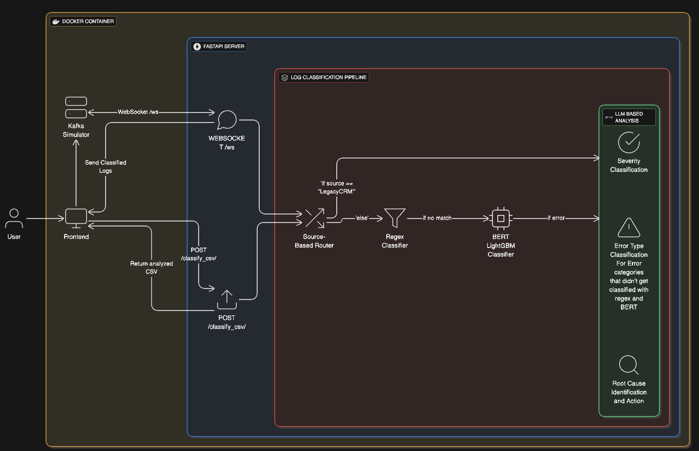

# RCAssist: Log Classification and Root Cause Analysis Assistant

RCAssist is a tool designed to help developers and operations teams make sense of application logs. It goes beyond simple log viewing by automatically classifying logs, identifying potential errors, and suggesting a root cause and a recommended course of action. The goal is to reduce the time spent manually digging through logs to find the source of a problem.
The application can process logs in two ways: through a real-time stream that simulates a live production environment, or by uploading a CSV file for batch analysis.
---
## System Architecture



### Overview
This diagram illustrates the architecture of the RCAssist application, a log analysis tool designed to classify, predict severity, and provide root cause analysis for log messages. The system is built around a FastAPI backend, with a clear separation of concerns for handling different data sources and processing logic.

### Component Breakdown

#### Frontend
The user interacts with the application through a web interface, which is served by the FastAPI backend. The frontend allows for two main modes of interaction:
* **Real-time Log Streaming**: A WebSocket connection is established to receive and display live log analysis. This curently just mimics kafka streaming, in the future the plan is to stream live logs as the input.
* **Batch CSV Upload**: Users can upload a CSV file containing log messages for batch processing and output csv gets downloaded.

#### FastAPI Server
The core of the application is a FastAPI server that handles all incoming requests and manages the application's logic. It exposes three main endpoints:
* `GET /`: Serves the main HTML page for the user interface.
* `WEBSOCKET /ws`: Establishes a WebSocket connection for real-time log analysis, powered by a Kafka simulator.
* `POST /classify_csv/`: Accepts a CSV file, processes the logs, and returns a new CSV file with the analysis results.

#### Log Classification Pipeline
The heart of the application is its multi-layered log classification pipeline. This pipeline uses a combination of different techniques to achieve accurate and efficient log analysis. The process is orchestrated by the `classify_log` function in `app/classify.py`.
* **Source-Based Routing**: The pipeline first checks the source of the log message. If the source is "LegacyCRM", the log is sent directly to the LLM-based classifier. This is because legacy systems lack clear logs generally.
* **Regex Classifier**: For all other sources, the log is first processed by a regex classifier. This is a fast and efficient way to catch common and well-defined log patterns without using huge models.
* **LightGBM+BERT Classifier**: If the regex classifier cannot determine a category, the log is then passed to a more sophisticated classifier that uses a pre-trained LightGBM model that uses BERT generated features. This allows for the classification of more complex and nuanced log messages.
* **LLM-Based Analysis (Groq)**: For logs identified as errors, or those from the "LegacyCRM" source, an LLM, provided by Groq, is used for deeper analysis. Its responsible for:
    * **Severity Classification**: Determining the severity of the log (e.g., Critical, High, Medium).
    * **Error Type Classification**: Categorizing the type of error (e.g., Workflow Error, Deprecation Warning).
    * **Root Cause and Action**: Providing a likely root cause for the error and a recommended action for developers to take.

#### Kafka Simulator
To demonstrate the real time capabilities of the application, a Kafka simulator is used. It sends sample log messages to the frontend via the WebSocket, mimicking a live stream of logs from a production environment.

#### Deployment
The entire application is containerized using Docker, as defined in the Dockerfile. This ensures that the application and its dependencies can be easily packaged and deployed in a consistent environment. The application is served using a Uvicorn server.

---

## Getting Started

The application is designed to be run with Docker, which simplifies the setup and ensures that all dependencies are handled correctly.

### Prerequisites

* Docker installed and running on your system.

### Running the Application

1.  **Clone the repository** (if you haven't already):
    ````bash
    git clone <your-repository-url>
    cd RCAssist
    ````

2.  **Build the Docker image**:
    This command will build the Docker image based on the instructions in the `Dockerfile`.
    ````bash
    docker build -t rcassist .
    ````

3.  **Run the Docker container**:
    This command starts the application and maps the necessary port to your local machine.
    ````bash
    docker run -p 7860:7860 rcassist
    ````

4.  **Access the application**:
    Once the container is running, you can open your web browser and navigate to `http://localhost:7860` to use the application.

---

## Usage

The web interface is straightforward and provides two main ways to analyze your logs.

### Real-time Log Analysis

When you first load the application, it will automatically connect to a real-time log simulator. New log messages will appear in the main window, along with their classification and analysis. This is useful for seeing how the system processes logs as they come in.

### Batch Processing with CSV

If you have a set of logs you'd like to analyze, you can use the file upload feature.

1.  Click the "Upload CSV" button.
2.  Select a CSV file from your computer. The file should have columns named `source` and `log_message`.
3.  The application will process the file and provide a new CSV for download, which includes the original log data enriched with the analysis results.